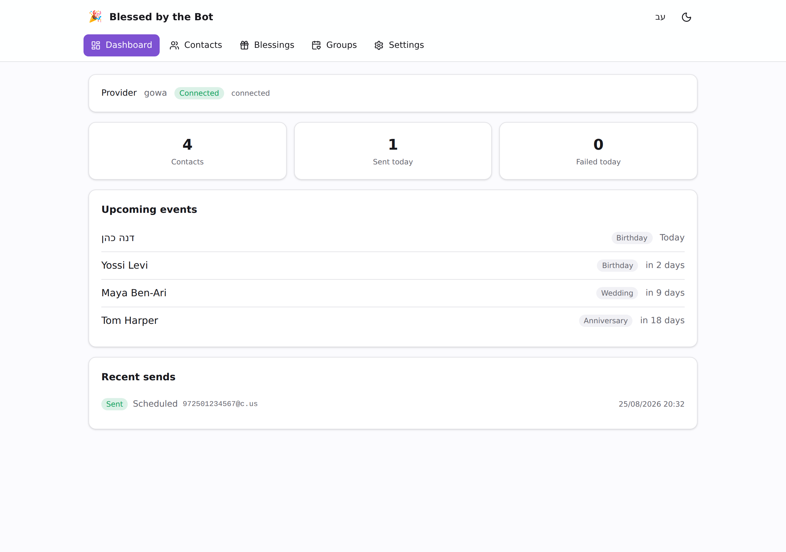
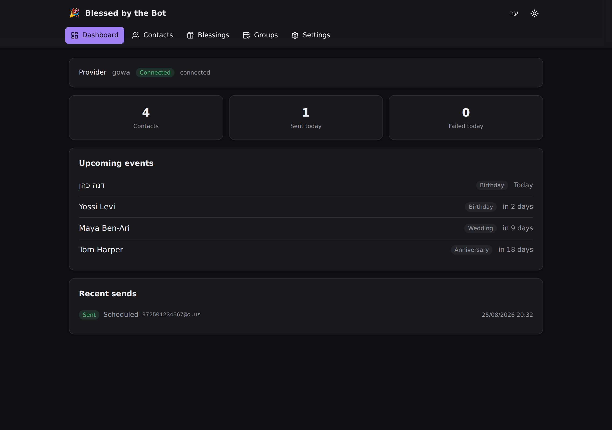
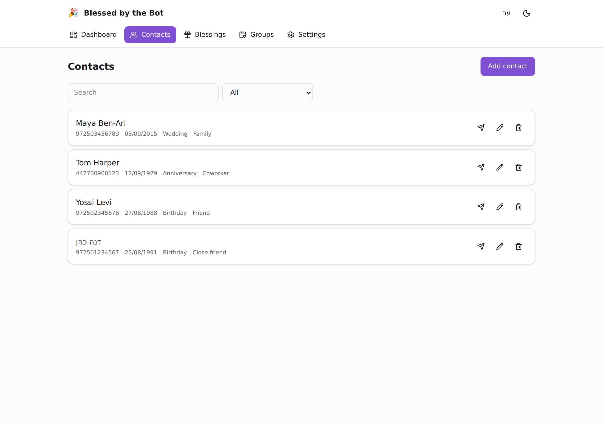
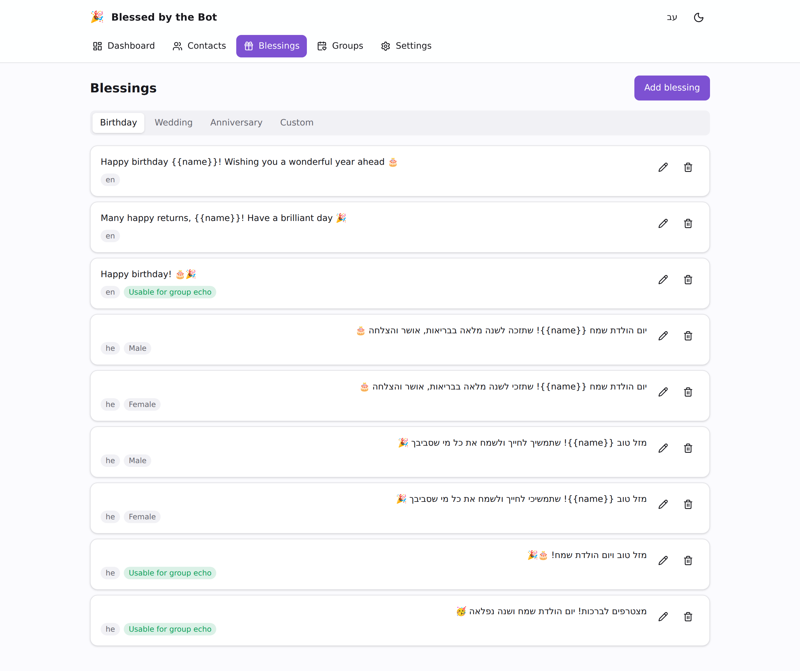
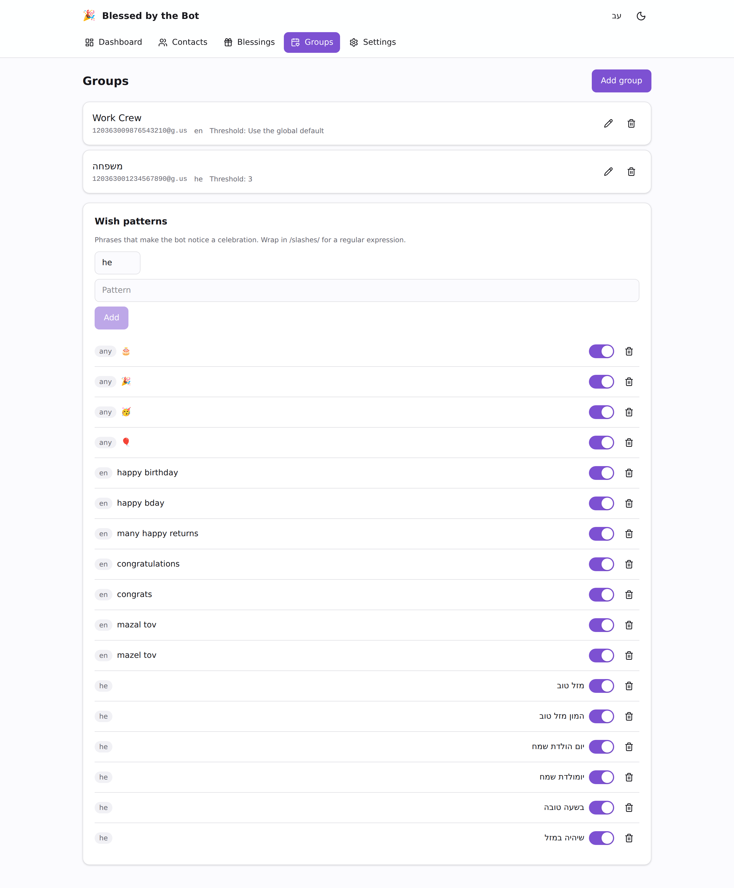
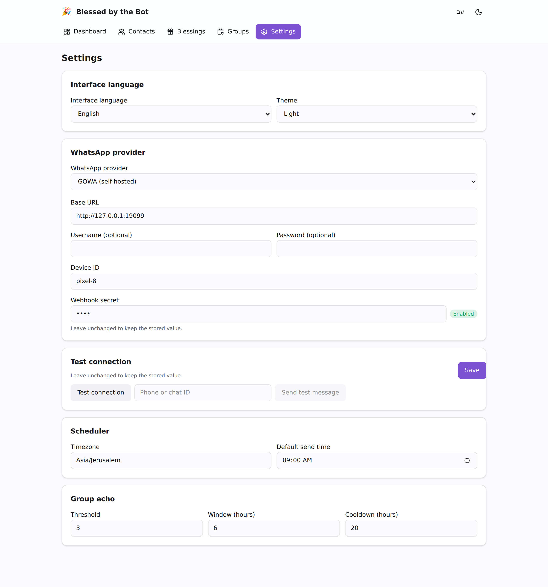
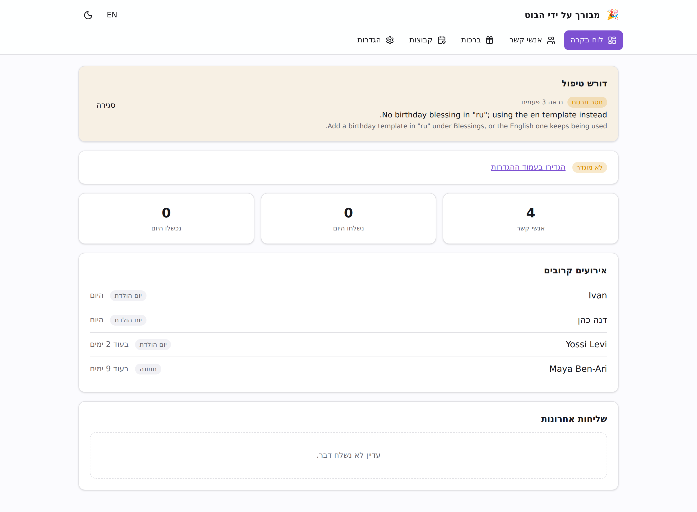
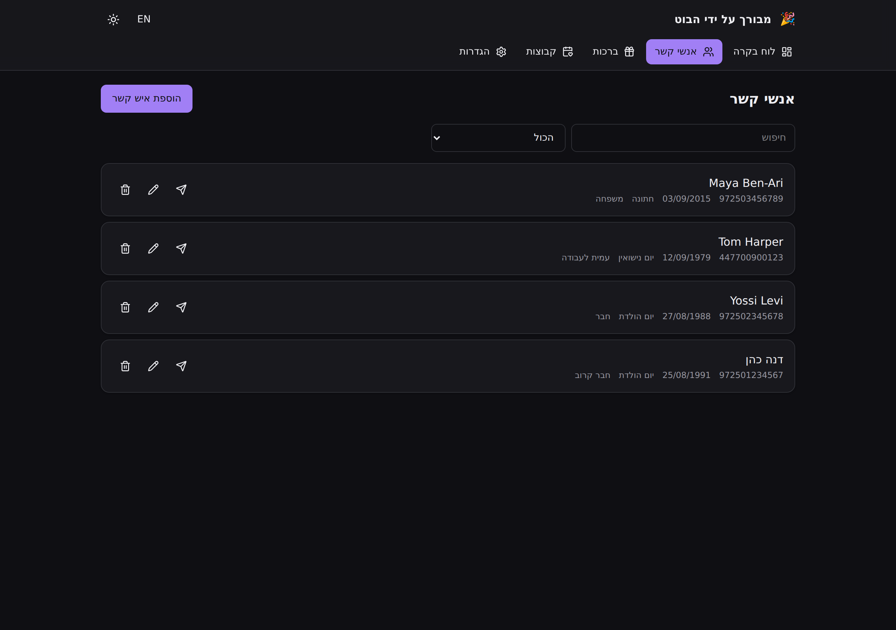
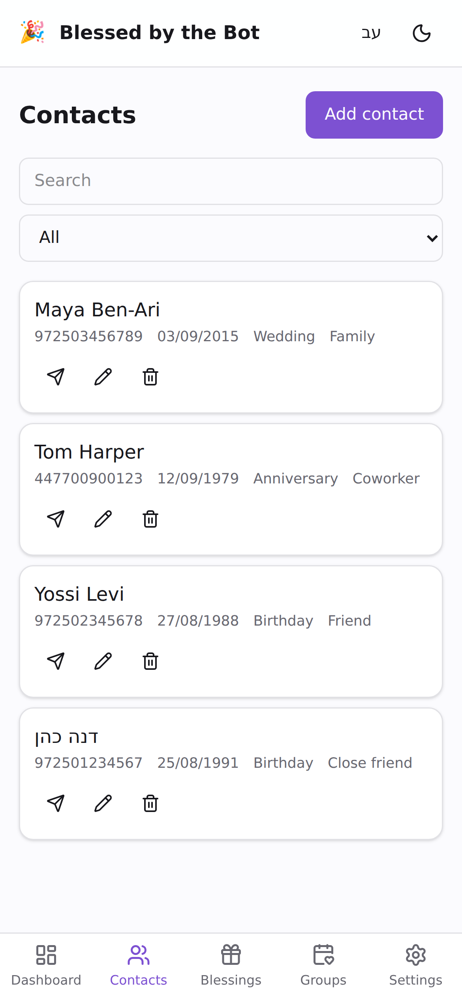

# blessed-by-the-bot

Self-hosted WhatsApp bot that sends automated blessings — birthdays, wedding
anniversaries and custom events — to your contacts on schedule, and joins in
when a watched group starts congratulating someone.

A single Go binary with the web UI embedded. No external database, no separate
frontend container, no cloud dependency beyond the WhatsApp provider you choose.



## What it does

**Scheduled blessings.** For every contact with an event today, at their send
time, the bot picks a fitting template and sends it. Selection prefers a
gender-matched template over a generic one — Hebrew greetings are grammatically
gendered — then a relation match, and it steers away from repeating last year's
message. Each contact gets exactly one blessing per event per year, enforced by
the send log rather than by memory, so a restart never sends twice.

**Group echo.** Watch a group, and when enough *different* people start
congratulating someone, the bot joins in once and then goes quiet. One excited
friend sending five messages counts as one voice. The blessing it posts in a
group never contains a name placeholder, because it does not know whose birthday
it is.

Wish detection understands vocalised Hebrew: `מַזָּל טוֹב` matches the plain
pattern `מזל טוב`, because text is normalized and combining marks are stripped
before matching. Patterns ship for Hebrew and English and are editable in the UI.

## Screenshots

### Dashboard — dark mode


### Contacts


### Blessings
Templates grouped by event type, with a live preview and targeting chips.


### Groups and wish patterns


### Settings
Provider configuration with masked credentials, scheduler defaults and group
echo tuning.


### Hebrew, right-to-left
The whole interface mirrors when the UI language is Hebrew. Blessing text
auto-detects its own direction, so a Hebrew template reads correctly even with
the interface in English.




### Mobile
The UI is mobile-first — this is mostly used from a phone.



## Quick start

### Docker Compose (recommended)

```bash
# Provider credentials are encrypted at rest with this key. Keep it: without it
# they cannot be decrypted, and the app refuses to start.
echo "BBTB_ENCRYPTION_KEY=$(docker run --rm techblog/blessed-by-the-bot genkey)" > .env

docker compose up -d
```

Open <http://localhost:8080> and configure a provider under **Settings**.

### Docker

```bash
docker run -d \
  --name blessedbot \
  -p 8080:8080 \
  -v blessedbot-data:/data \
  -e BBTB_ENCRYPTION_KEY="$(docker run --rm techblog/blessed-by-the-bot genkey)" \
  techblog/blessed-by-the-bot:latest
```

### From source

```bash
make build       # builds the frontend, then the binary that embeds it
export BBTB_ENCRYPTION_KEY="$(./bin/blessedbot genkey)"
./bin/blessedbot
```

## First run

The database ships with **starter blessing templates** (Hebrew and English, for
birthdays, weddings and anniversaries) and **wish patterns**, so the bot can send
before you have written anything. All of them are editable or deletable.

You still need to:

1. Choose and configure a provider under **Settings** — see
   [docs/providers.md](docs/providers.md).
2. Add contacts with their event dates.
3. Optionally add groups to watch.

## WhatsApp providers

Both are implemented; pick one in the UI and switch at any time without a
restart.

| | **GreenAPI** | **GOWA** |
|---|---|---|
| Kind | Cloud service | Self-hosted ([go-whatsapp-web-multidevice](https://github.com/aldinokemal/go-whatsapp-web-multidevice)) |
| Inbound | Polling *(default)* or webhook | Webhook, HMAC-signed |
| Needs a public URL | No, when polling | No, if it can reach this app |

Polling is the default because a home-lab deployment usually is not
internet-exposed. Full setup for both: [docs/providers.md](docs/providers.md).

## Configuration

Infrastructure settings come from flags, environment variables or a YAML file.
Everything else — providers, send times, thresholds — lives in the database and
is edited in the UI.

Precedence: **flag → environment → config file → default**.

| Flag | Environment | Default | Purpose |
|---|---|---|---|
| `--port` | `BBTB_PORT` | `8080` | HTTP listen port |
| `--data-dir` | `BBTB_DATA_DIR` | `./data` (`/data` in Docker) | SQLite database and state |
| `--log-level` | `BBTB_LOG_LEVEL` | `info` | `debug`, `info`, `warn`, `error` |
| `--config` | — | `./config.yaml` | Optional YAML config |
| `--dev` | — | off | Verbose logs; waives the encryption-key requirement |
| — | `BBTB_ENCRYPTION_KEY` | — | **Required.** Base64 AES-256 key. Env only — never a flag or config value, so it cannot end up in a shell history or a committed file |

### Commands

| Command | Purpose |
|---|---|
| `blessedbot` | Run the server |
| `blessedbot genkey` | Generate a `BBTB_ENCRYPTION_KEY` |
| `blessedbot version` | Print the version |
| `blessedbot healthcheck` | Probe `/healthz`; exits non-zero when unhealthy |

## Endpoints

| Path | Purpose |
|---|---|
| `/` | Web UI |
| `/api/v1/…` | REST API — [docs/api.md](docs/api.md) |
| `/webhooks/greenapi`, `/webhooks/gowa` | Provider callbacks |
| `/healthz` | Liveness, including a database ping |
| `/metrics` | Prometheus metrics |

### Metrics

| Metric | Labels |
|---|---|
| `blessedbot_messages_total` | `provider`, `kind`, `outcome` |
| `blessedbot_webhooks_total` | `provider`, `result` |
| `blessedbot_wishes_matched_total` | `chat_id` |
| `blessedbot_group_echoes_total` | `chat_id`, `outcome` |
| `blessedbot_scheduler_ticks_total` | `result` |
| `blessedbot_provider_request_seconds` | `provider`, `outcome` |

Series with known labels are created at startup, so a quiet instance reports
`0` rather than no data — an alert on failures can fire from the first scrape.

## Security

- Provider credentials are **encrypted at rest with AES-256-GCM**. The API
  returns `••••` for a stored secret and never the value; sending the mask back
  means "unchanged".
- GOWA webhooks require a valid HMAC signature and **fail closed**: with no
  secret configured, every webhook is rejected.
- The container runs as a non-root user from a `scratch` base — no shell, no
  package manager, ~16 MB.
- There is **no authentication on the API in v1**. It is built for a LAN or
  home-lab deployment; do not expose it to the internet without a reverse proxy
  that adds authentication.

## Security scanning

CI runs these on every push and pull request, and weekly on a schedule — a
dependency CVE can appear without anyone touching the code:

| Scanner | Covers | Needs a secret |
|---|---|---|
| `govulncheck` | Go dependencies and the standard library | no |
| `gitleaks` | hardcoded secrets, across the full git history | no |
| Trivy (fs) | dependency CVEs and secrets in the tree | no |
| Trivy (config) | Dockerfile and compose misconfiguration | no |
| Trivy (image) | the container image, built fresh in CI | no |
| `npm audit` | frontend dependencies | no |
| `actionlint` | the workflows themselves, including injection patterns | no |
| Snyk | Go dependencies | `SNYK_TOKEN` |
| SonarQube | static analysis and coverage | `SONAR_TOKEN`, `SONAR_HOST_URL` |

Each job fails the build on a HIGH or CRITICAL finding, so they can be marked
required in branch protection. The two commercial scanners are **skipped, not
failed**, when their secrets are absent — an unconfigured integration should not
put a permanent red X on every PR.

Every third-party action is pinned to a **commit SHA**, and the tools the jobs
install are pinned to versions — a scanner that runs whatever upstream published
this morning is its own supply-chain risk. The gitleaks download is checksum-
verified rather than piped straight into `tar`.

The Go toolchain is pinned in `go.mod` via a `toolchain` directive rather than
left to float. Most `govulncheck` findings in a project like this are stdlib
ones, and they are fixed by a patch release; pinning is what makes that
upgrade an explicit, reviewable change.

## Development

```bash
make dev          # API + Vite dev server with hot reload, on :5173
make test         # go test ./...
make test-race    # race detector (needs cgo; shipped builds are CGO_ENABLED=0)
make lint         # go vet + golangci-lint
make web          # build only the frontend into internal/webui/dist
make build-go     # build only the binary, reusing the existing embed dir
make docker       # build the image locally
```

Stack: Go 1.25, chi, `modernc.org/sqlite` (pure Go — no cgo anywhere),
React + Vite + TypeScript + Tailwind.

## License

Apache-2.0. See [LICENSE](LICENSE).
