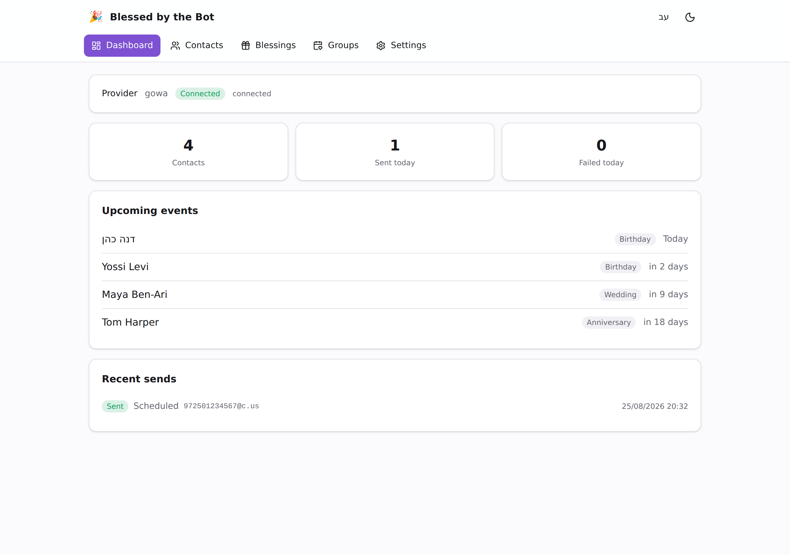
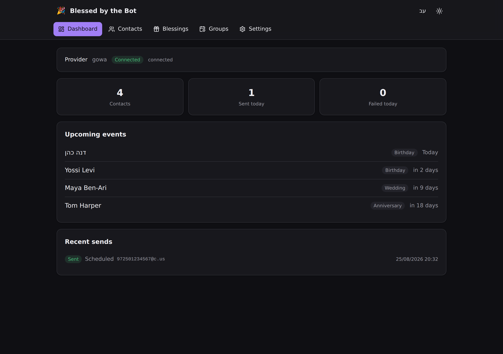
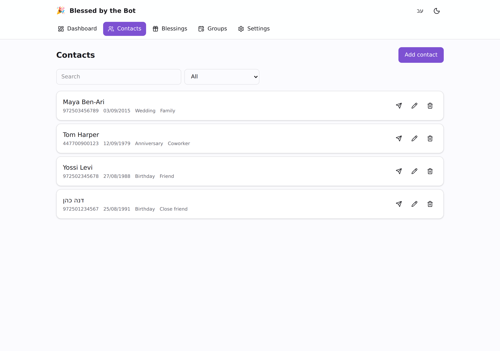
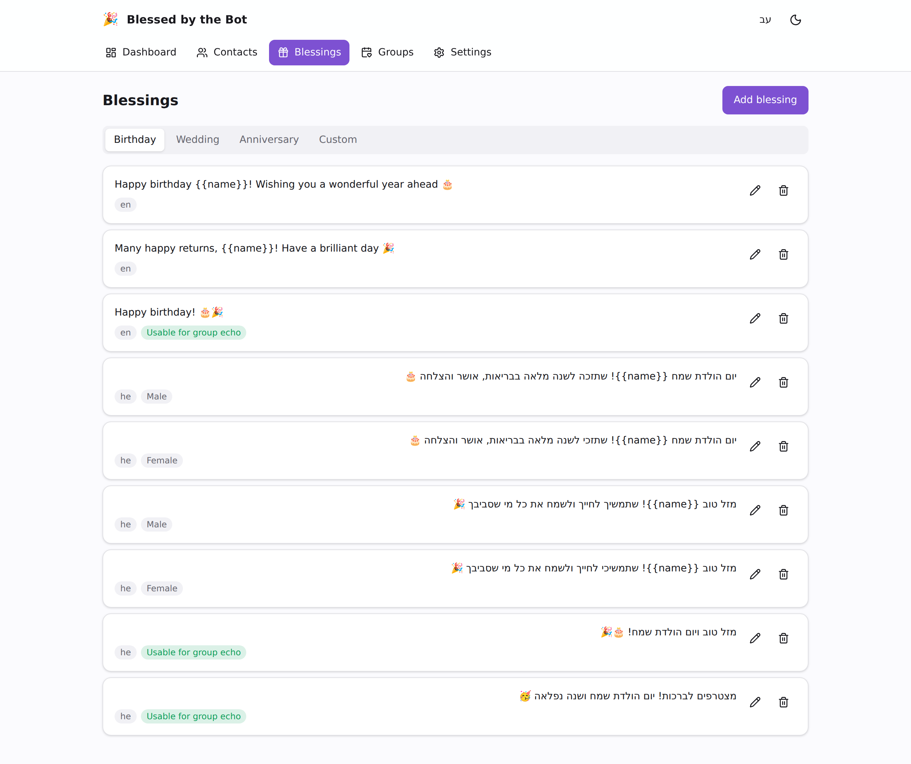
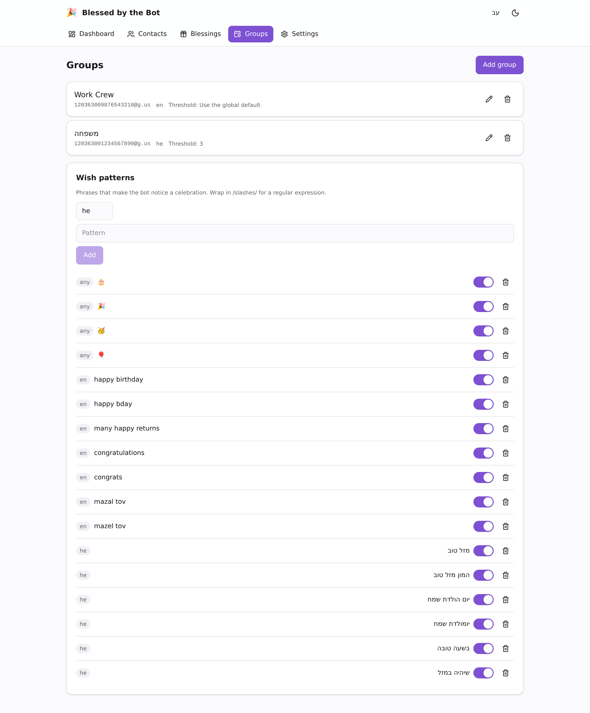
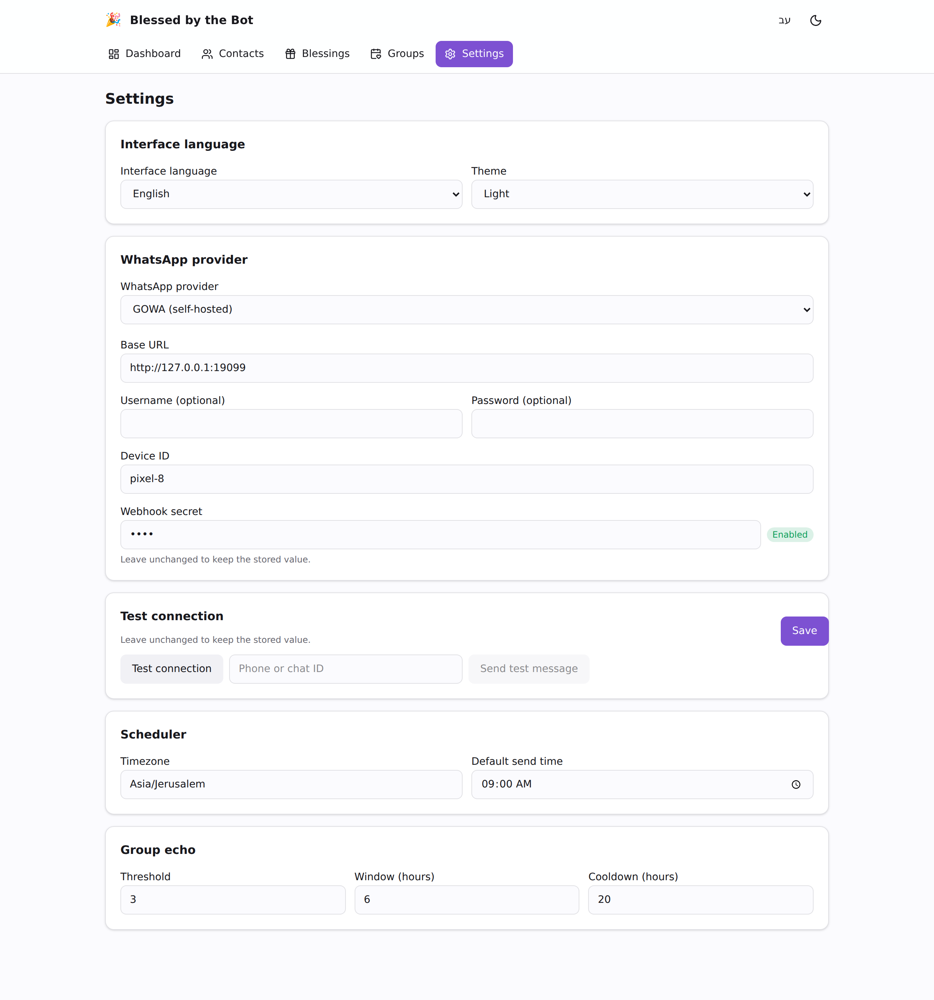
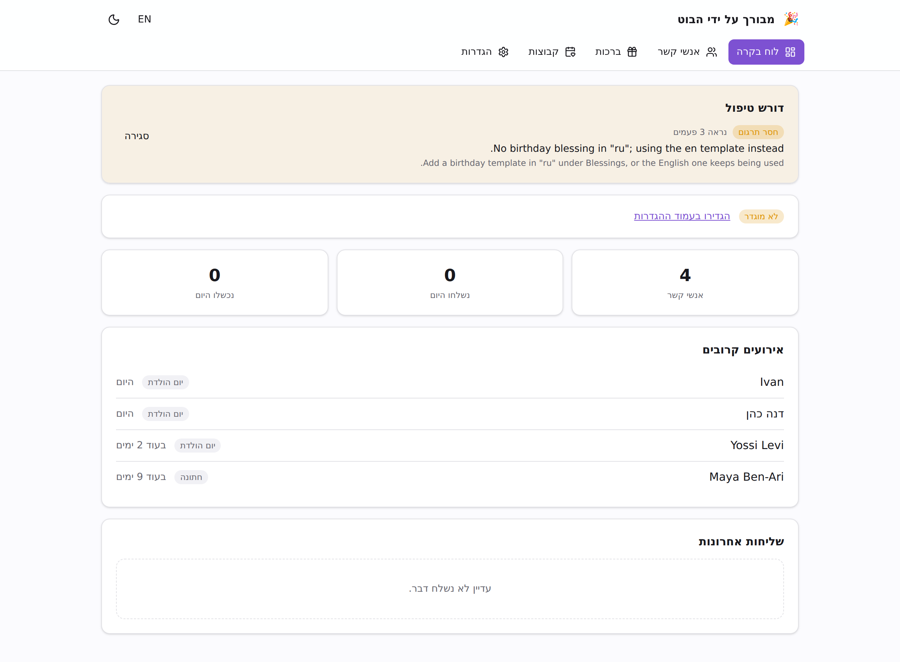
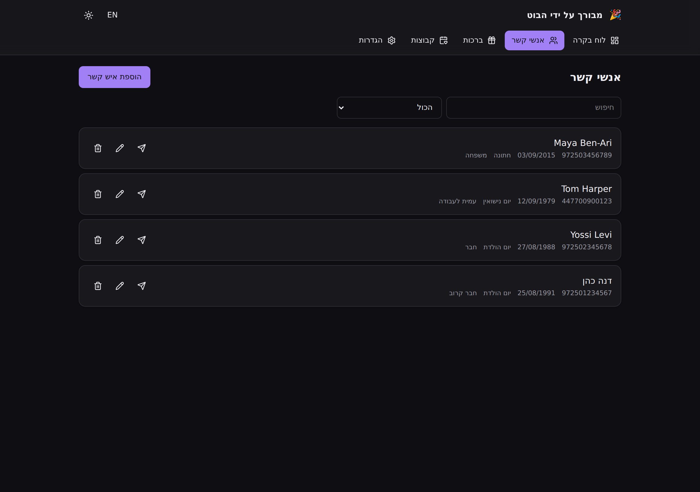
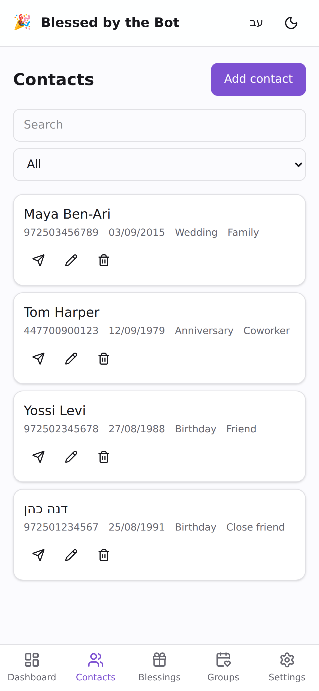
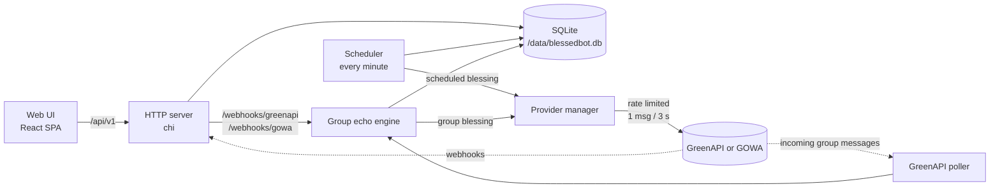

# blessed-by-the-bot

[](https://github.com/t0mer/blessed-by-the-bot/actions/workflows/ci.yml)
[](https://github.com/t0mer/blessed-by-the-bot/actions/workflows/security.yml)
[](LICENSE)

Self-hosted WhatsApp bot that sends automated blessings — birthdays, weddings,
wedding anniversaries and custom events — to your contacts on schedule, and
joins in when a watched group starts congratulating someone.

A single Go binary with the web UI embedded. No external database, no separate
frontend container, no cloud dependency beyond the WhatsApp provider you choose.



## Table of contents

- [What it does](#what-it-does)
- [Features](#features)
- [Screenshots](#screenshots)
- [How it works](#how-it-works)
- [Requirements](#requirements)
- [Installation](#installation)
- [First run](#first-run)
- [WhatsApp providers](#whatsapp-providers)
- [Configuration](#configuration)
- [Usage](#usage)
- [Endpoints](#endpoints)
- [Security](#security)
- [Security scanning](#security-scanning)
- [Troubleshooting](#troubleshooting)
- [Development](#development)
- [Contributing](#contributing)
- [License](#license)

## What it does

**Scheduled blessings.** For every contact with an event today, at their send
time, the bot picks a fitting template and sends it. Selection prefers a
gender-matched template over a generic one — Hebrew greetings are grammatically
gendered — then a relation match, and it steers away from repeating last year's
message. Each contact gets exactly one blessing per event per year, enforced by
the send log rather than by memory, so a restart never sends twice.

**Group echo.** Watch a group, and when enough *different* people start
congratulating someone, the bot joins in once and then goes quiet. One excited
friend sending five messages counts as one voice. The blessing it posts in a
group never contains a name placeholder, because it does not know whose birthday
it is.

Wish detection understands vocalized Hebrew: `מַזָּל טוֹב` matches the plain
pattern `מזל טוב`, because text is normalized and combining marks are stripped
before matching. Patterns ship for Hebrew and English and are editable in the UI.

## Features

- **Contacts** with a recurring event (`birthday`, `wedding`, `anniversary`,
  `custom`), language, gender, relation, importance, an optional per-contact
  send time and an enable switch.
- **Blessing templates** per event type and language, optionally targeted by
  gender and relation. `{{name}}` is replaced with the contact's name.
- **Scheduler** that checks for due contacts every minute in the configured
  timezone (IANA zone data is embedded in the binary). The first check runs at
  startup, so a restart after the send time still delivers today's blessing.
  A failed send is retried on the next check for the rest of the day.
- **February 29** events are observed on February 28 in common years.
- **Send now** for any contact, with a guard against sending twice in the same
  event year (override with `force=true` in the API).
- **Group echo** with a distinct-sender threshold, rolling window and cooldown,
  set globally; the threshold can be overridden per group.
- **Editable wish patterns** per language, matched against normalized text.
- **Language fallback**: when a contact's language has no template the bot
  falls back to English and raises a **notice**, shown as a banner on the
  dashboard with what to do about it. A log line is invisible to someone using
  the web UI, and the condition recurs every year until a template is added.
- **Two WhatsApp providers** — GreenAPI (cloud) and GOWA (self-hosted) —
  switchable at runtime without a restart.
- **Send history** of every scheduled blessing and group echo, sent or failed.
- **Outbound pacing** of one message every three seconds, plus retries with
  jittered backoff for network errors, `5xx` and `429`.
- **Web UI** in English and Hebrew (full right-to-left layout), with light,
  dark and system themes; mobile-first.
- **REST API** for everything the UI does, and **Prometheus metrics**.
- **Encrypted credentials** (AES-256-GCM) and a ~16 MB non-root `scratch`
  container image. <!-- TODO: verify image size -->

## Screenshots

### Dashboard — dark mode


### Contacts


### Blessings
Templates grouped by event type, with a live preview and targeting chips.


### Groups and wish patterns


### Settings
Provider configuration with masked credentials, scheduler defaults and group
echo tuning.


### Hebrew, right-to-left
The whole interface mirrors when the UI language is Hebrew. Blessing text
auto-detects its own direction, so a Hebrew template reads correctly even with
the interface in English.




### Mobile
The UI is mobile-first — this is mostly used from a phone.



## How it works


```mermaid
flowchart LR
    UI[Web UI<br/>React SPA] -->|/api/v1| API[HTTP server<br/>chi]
    API --> DB[(SQLite<br/>/data/blessedbot.db)]
    SCHED[Scheduler<br/>every minute] --> DB
    SCHED -->|scheduled blessing| PROV[Provider manager]
    ECHO[Group echo engine] -->|group blessing| PROV
    ECHO --> DB
    LISTEN[GreenAPI poller] --> ECHO
    API -->|/webhooks/greenapi<br/>/webhooks/gowa| ECHO
    PROV -->|rate limited<br/>1 msg / 3 s| WA[(GreenAPI or GOWA)]
    WA -.->|incoming group messages| LISTEN
    WA -.->|webhooks| API
```

- One process runs the HTTP server, the scheduler, the group echo engine (plus
  a janitor that prunes old wish events) and the GreenAPI polling listener.
- Everything is stored in a single SQLite database (`blessedbot.db`) in the data
  directory, using the pure-Go `modernc.org/sqlite` driver. Migrations and the
  starter templates are applied automatically on startup.
- Saving settings rebuilds the active provider and restarts the polling loop in
  place — no process restart.

## Requirements

- A WhatsApp account for the bot, connected through either:
  - a [GreenAPI](https://green-api.com) instance, or
  - a self-hosted [GOWA](https://github.com/aldinokemal/go-whatsapp-web-multidevice)
    (go-whatsapp-web-multidevice) v8.x instance.
- A 32-byte AES key, base64-encoded, in `BBTB_ENCRYPTION_KEY` (generate one with
  `blessedbot genkey`).
- To build and run: Go 1.25 and Node.js 22, or Docker to build and run the
  image locally.

## Installation

> **No release has been published yet** — there are no Docker Hub or GHCR
> images and no GitHub release binaries. Until the first release, build from
> source or build the Docker image locally as shown below.

### From source

Requires Go 1.25 and Node.js 22.

```bash
git clone https://github.com/t0mer/blessed-by-the-bot.git
cd blessed-by-the-bot
make build       # builds the frontend, then the binary that embeds it
export BBTB_ENCRYPTION_KEY="$(./bin/blessedbot genkey)"
./bin/blessedbot
```

Save the generated key somewhere safe — you need the same key on every start.

### Docker (image built locally)

Build the image from the repository root. Tagging it
`techblog/blessed-by-the-bot:latest` lets the bundled
[`docker-compose.yml`](docker-compose.yml) use it unchanged:

```bash
docker build -t techblog/blessed-by-the-bot:latest .
```

#### Docker Compose

```bash
# Provider credentials are encrypted at rest with this key. Keep it: without it
# they cannot be decrypted, and the app refuses to start.
echo "BBTB_ENCRYPTION_KEY=$(docker run --rm techblog/blessed-by-the-bot:latest genkey)" > .env

docker compose up -d
```

Open <http://localhost:8080> and configure a provider under **Settings**.

The compose file uses a **named volume** for `/data`: the image runs as uid
`65532`, and a root-owned bind-mounted host directory would not be writable. It
also contains a commented-out GOWA service you can enable to run everything in
one stack.

#### docker run

```bash
docker run -d \
  --name blessedbot \
  -p 8080:8080 \
  -v blessedbot-data:/data \
  -e BBTB_ENCRYPTION_KEY="$(docker run --rm techblog/blessed-by-the-bot:latest genkey)" \
  techblog/blessed-by-the-bot:latest
```

Save the generated key somewhere safe — you need the same key on every start.

### Published images and binaries (once released)

The release workflows are in place but have not been run yet. Once they are:

- The **Docker** workflow will push `techblog/blessed-by-the-bot:latest` and
  `:<version>` to Docker Hub, for `linux/amd64`, `linux/arm64` and
  `linux/arm/v7`.
- The manual **Publish to GHCR** workflow will push
  `ghcr.io/t0mer/blessed-by-the-bot:latest` and `:<tag>` for the same
  platforms.
- The **Release** workflow (GoReleaser) will attach archives to a
  [GitHub release](https://github.com/t0mer/blessed-by-the-bot/releases) for:

  | OS | Architectures |
  |---|---|
  | Linux | `amd64`, `arm64`, `armv7` |
  | macOS | `amd64`, `arm64` |
  | Windows | `amd64`, `arm64` (`.zip`) |

  Each archive will contain the `blessedbot` binary (with the UI embedded),
  `README.md`, `LICENSE`, `config.example.yaml` and the `docs/` folder, with a
  `checksums.txt` alongside.

Versions will follow a date-based `YYYY.M.PATCH` scheme.

## First run

The database ships with **starter blessing templates** (Hebrew and English, for
birthdays, weddings, anniversaries and custom events) and **wish patterns**, so
the bot can send before you have written anything. All of them are editable or
deletable.

You still need to:

1. Choose and configure a provider under **Settings** — see
   [docs/providers.md](docs/providers.md).
2. Add contacts with their event dates.
3. Optionally add groups to watch.

## WhatsApp providers

Both are implemented; pick one in the UI and switch at any time without a
restart.

| | **GreenAPI** | **GOWA** |
|---|---|---|
| Kind | Cloud service | Self-hosted ([go-whatsapp-web-multidevice](https://github.com/aldinokemal/go-whatsapp-web-multidevice)) |
| Inbound | Polling *(default)* or webhook | Webhook, HMAC-signed |
| Needs a public URL | No, when polling | No, if it can reach this app |

<!-- TODO: docs/providers.md says "Yes, for webhooks" — reconcile -->

Polling is the default because a home-lab deployment usually is not
internet-exposed. Full setup for both, including the GOWA compose snippet, the
chat ID format and how self-sent messages are ignored:
[docs/providers.md](docs/providers.md).

## Configuration

Infrastructure settings come from flags, environment variables or a YAML file.
Everything else — providers, send times, thresholds — lives in the database and
is edited in the UI.

### Infrastructure (flags, environment, YAML)

Precedence: **flag → environment → config file → default**.

| Flag | Environment | YAML key | Default | Purpose |
|---|---|---|---|---|
| `--port` | `BBTB_PORT` | `port` | `8080` | HTTP listen port |
| `--data-dir` | `BBTB_DATA_DIR` | `data-dir` | `./data` (`/data` in Docker) | Directory for the SQLite database and state |
| `--log-level` | `BBTB_LOG_LEVEL` | `log-level` | `info` | `debug`, `info`, `warn`, `error` |
| `--config` | `BBTB_CONFIG` | — | `./config.yaml` if present | Path to an optional YAML config file |
| `--dev` | `BBTB_DEV` | `dev` | `false` | Development mode: verbose text logs; waives the encryption-key requirement. Never enable in production |
| — | `BBTB_ENCRYPTION_KEY` | — | — | **Required.** Base64 AES-256 key. Env only — never a flag or config value, so it cannot end up in a shell history or a committed file |

A sample file with every key is in
[`config.example.yaml`](config.example.yaml); copy it to `config.yaml` or pass
`--config /path/to/config.yaml`.

In `--dev` mode without `BBTB_ENCRYPTION_KEY`, a key is generated once and
stored as `dev-encryption.key` in the data directory.

The data directory holds `blessedbot.db` (contacts, templates, send log and the
encrypted provider credentials). Back it up together with
`BBTB_ENCRYPTION_KEY`.

### Runtime settings (web UI)

Edited under **Settings** (or `PUT /api/v1/settings`), stored in the database
and applied immediately.

| Setting | Default | Notes |
|---|---|---|
| Provider | `greenapi` | `greenapi` or `gowa` |
| GreenAPI → API URL | `https://api.green-api.com` | Use your cluster host if the console shows one |
| GreenAPI → Instance ID / API token | — | Token is encrypted at rest |
| GreenAPI → Mode | `polling` | `polling` or `webhook` |
| GreenAPI → Webhook auth header | — | Optional; webhook mode only; encrypted |
| GOWA → Base URL | — | e.g. `http://gowa:3000` |
| GOWA → Username / Password | — | Must match GOWA's `--basic-auth`; password encrypted |
| GOWA → Device ID | — | Sent as `X-Device-Id`; blank = GOWA's single device |
| GOWA → Webhook secret | — | **Required** for GOWA webhooks; encrypted |
| Scheduler → Timezone | `Asia/Jerusalem` | Any IANA zone name |
| Scheduler → Send time | `09:00` | `HH:MM`, 24-hour; contacts can override it |
| Group echo → Threshold | `3` | Distinct senders needed to trigger an echo; groups can override it |
| Group echo → Window | `6` hours | Rolling window the senders must fall inside |
| Group echo → Cooldown | `20` hours | Quiet period after an echo |

## Usage

### Web UI

- **Dashboard** — stats, recent sends and active notices; refreshes every 60 s.
- **Contacts** — add, edit, enable/disable, delete, and **send now**.
- **Blessings** — manage templates per event type and language, with a live
  preview and gender/relation targeting.
- **Groups** — pick groups from the connected WhatsApp account, set a language
  and optional threshold per group, and edit wish patterns.
- **Settings** — provider credentials, **Test connection**, **Send test
  message**, scheduler defaults and group echo tuning.

The navbar switches the UI language (English/Hebrew) and theme
(light/dark/system).

### Commands

| Command | Purpose |
|---|---|
| `blessedbot` | Run the server |
| `blessedbot genkey` | Generate a `BBTB_ENCRYPTION_KEY` |
| `blessedbot version` | Print the version, commit and build date (the Docker image injects only the version; commit and date show `none` / `unknown`) |
| `blessedbot healthcheck [--url URL]` | Probe `/healthz` (default `http://127.0.0.1:8080/healthz`); exits non-zero when unhealthy |

## Endpoints

| Path | Purpose |
|---|---|
| `/` | Web UI |
| `/api/v1/…` | REST API — [docs/api.md](docs/api.md) |
| `/webhooks/greenapi`, `/webhooks/gowa` | Provider callbacks |
| `/healthz` | Liveness, including a database ping |
| `/metrics` | Prometheus metrics |

### REST API summary

All resources live under `/api/v1`, use JSON, and share one error envelope. Full
reference with request bodies, examples and error codes:
[docs/api.md](docs/api.md).

| Resource | Endpoints |
|---|---|
| Health | `GET /healthz` |
| Contacts | `GET`, `POST /contacts`; `GET`, `PUT`, `DELETE /contacts/{id}`; `POST /contacts/{id}/send-now` |
| Blessings | `GET`, `POST /blessings`; `GET`, `PUT`, `DELETE /blessings/{id}` |
| Groups | `GET`, `POST /groups`; `GET /groups/available`; `GET`, `PUT`, `DELETE /groups/{id}` |
| Wish patterns | `GET`, `POST /wish-patterns`; `PUT`, `DELETE /wish-patterns/{id}` |
| Settings | `GET`, `PUT /settings` |
| Provider | `GET /provider/status`; `POST /provider/test` |
| History | `GET /history?kind=&limit=` |
| Notices | `GET /notices[?all=true]`; `DELETE /notices/{id}` |

### Metrics

| Metric | Labels |
|---|---|
| `blessedbot_messages_total` | `provider`, `kind`, `outcome` |
| `blessedbot_webhooks_total` | `provider`, `result` |
| `blessedbot_wishes_matched_total` | `chat_id` |
| `blessedbot_group_echoes_total` | `chat_id`, `outcome` |
| `blessedbot_scheduler_ticks_total` | `result` |
| `blessedbot_provider_request_seconds` | `provider`, `outcome` |

Series with known labels are created at startup, so a quiet instance reports
`0` rather than no data — an alert on failures can fire from the first scrape.

## Security

- Provider credentials are **encrypted at rest with AES-256-GCM**. The API
  returns `••••` for a stored secret and never the value; sending the mask back
  means "unchanged".
- GOWA webhooks require a valid HMAC signature (`X-Hub-Signature-256`) and
  **fail closed**: with no secret configured, every webhook is rejected.
- GreenAPI webhooks are checked against the optional auth header in constant
  time. Leaving it blank accepts any caller — only do that on a trusted network.
- The container runs as a non-root user from a `scratch` base — no shell, no
  package manager.
- There is **no authentication on the API in v1**. It is built for a LAN or
  home-lab deployment; do not expose it to the internet without a reverse proxy
  that adds authentication.

## Security scanning

CI runs these on every push and pull request to `main`, and weekly
on a schedule — a dependency CVE can appear without anyone touching the code:

| Scanner | Covers | Needs a secret |
|---|---|---|
| `govulncheck` | Go dependencies and the standard library | no |
| `gitleaks` | hardcoded secrets, across the full git history | no |
| Trivy (fs) | dependency CVEs and secrets in the tree | no |
| Trivy (config) | Dockerfile and compose misconfiguration | no |
| Trivy (image) | the container image, built fresh in CI | no |
| `npm audit` | frontend dependencies | no |
| `actionlint` | the workflows themselves, including injection patterns | no |
| Snyk | Go dependencies | `SNYK_TOKEN` |
| SonarQube | static analysis and coverage | `SONAR_TOKEN`, `SONAR_HOST_URL` |

Trivy (HIGH and CRITICAL), `npm audit` (`--audit-level=high`) and Snyk
(`--severity-threshold=high`) fail the build on high-severity findings;
`govulncheck`, `gitleaks` and `actionlint` fail on any finding. SonarQube
reports but has no quality gate configured in the workflow. The two commercial
scanners are **skipped, not failed**, when their secrets are absent — an
unconfigured integration should not put a permanent red X on every PR.

> **Known issue:** the Trivy jobs currently fail before scanning
> ("Unable to resolve action `aquasecurity/setup-trivy@v0.2.2`"), so the
> dependency, config and image scans are not running until the pinned Trivy
> action is updated.

Every third-party action in the security workflow is pinned to a **commit
SHA**, and the tools the jobs install are pinned to versions — a scanner that
runs whatever upstream published this morning is its own supply-chain risk. The
gitleaks download is checksum-verified rather than piped straight into `tar`.

The Go toolchain is pinned in `go.mod` via a `toolchain` directive rather than
left to float. Most `govulncheck` findings in a project like this are stdlib
ones, and they are fixed by a patch release; pinning is what makes that
upgrade an explicit, reviewable change.

## Troubleshooting

| Symptom | Cause and fix |
|---|---|
| `BBTB_ENCRYPTION_KEY is required (or pass --dev)` | Set the key in the environment (`blessedbot genkey`). It cannot be set by flag or YAML. |
| `encryption key is N bytes, want 32` | The key must be a base64-encoded 32-byte value; generate one with `genkey`. |
| Startup fails after changing the key | Stored credentials can only be decrypted with the key they were saved with. Restore the original key. |
| Database cannot be created in `/data` (permission denied) | Use a named volume, or make a bind-mounted directory writable by uid `65532`. |
| Page says "UI not built" | The binary was built without the frontend. Use `make build` (or `make web`) instead of a plain `go build`. |
| GreenAPI returns `400` | Whitespace in the Instance ID or token — copy them with the console's copy button. See [docs/providers.md](docs/providers.md). |
| GOWA webhooks rejected (`401`) | Set the same webhook secret in Settings and in GOWA's `--webhook-secret`. |
| No incoming group messages with GreenAPI | Polling starts only once the Instance ID and token are filled in. In webhook mode GreenAPI must be able to reach `/webhooks/greenapi`. |
| A contact got an English blessing | No template exists in the contact's language; check the notice on the dashboard and add one under **Blessings**. |

## Development

```bash
make dev          # API + Vite dev server with hot reload, on :5173
make test         # Go and frontend suites
make test-go      # go test ./...
make test-web     # frontend type check + vitest
make test-race    # race detector (needs cgo; shipped builds are CGO_ENABLED=0)
make lint         # go vet + golangci-lint
make fmt          # gofmt -s -w .
make web          # build only the frontend into internal/webui/dist
make build-go     # build only the binary, reusing the existing embed dir
make docker       # build the image locally as techblog/blessed-by-the-bot:dev
```

Stack: Go 1.25, chi, Cobra + Viper, `modernc.org/sqlite` (pure Go — no cgo
anywhere), Prometheus client, React + Vite + TypeScript + Tailwind, Vitest +
Testing Library.

The frontend suite (176 tests) covers the logic most likely to drift or bite: the
recurrence maths (which is duplicated from the Go scheduler, Feb-29 rule
included), right-to-left detection, the error-envelope contract that puts a
server-side field error under the right form input, the secret-mask round-trip,
every API client method and path, the edit-in-place and delete-confirm paths on
each list page, and Hebrew/English dictionary parity — a key added to one
dictionary and forgotten in the other is otherwise invisible.

### Project layout

```
cmd/blessedbot/          entry point and CLI commands
internal/config/         flags, environment and YAML loading
internal/crypto/         AES-256-GCM for secrets at rest
internal/handlers/       REST API and webhook handlers
internal/logging/        slog logger: JSON in production, text in --dev
internal/provider/       provider interface, rate limiting, retries
  greenapi/  gowa/       the two WhatsApp providers
  factory/               builds the active provider from settings
internal/server/         chi router, middleware and HTTP lifecycle
internal/service/        scheduler, blessing selector, group echo, listener, settings
internal/store/          SQLite store and migrations
internal/metrics/        Prometheus metrics
internal/webui/          embedded frontend build
web/                     React + Vite frontend source
docs/                    API and provider documentation
```

### Releases

Releases are cut manually with the **Release** workflow (GoReleaser, date-based
`YYYY.M.PATCH` versions from `scripts/next-version.sh`); the **Docker**
workflow then publishes the multi-arch image to Docker Hub. No release has
been run yet.

## Contributing

Issues and pull requests are welcome. Before opening a PR, run `make lint` and
`make test`; CI runs the same checks plus the security scans above.

## License

Apache-2.0. See [LICENSE](LICENSE).
